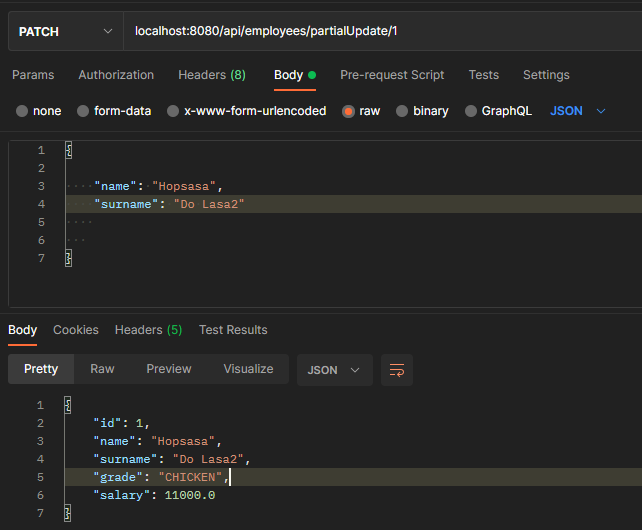

# Basic CRUD operations on employees
#
#Technologies
* Java 1.8
* Spring Boot
* Spring Data
* Swagger
* Docker
* Lombok
* Maven
* JUnit 4
* In-Memory H2 Database

### Reference Documentation

* [Swagger Api Documentation](http://localhost:8080/swagger-ui/#/)
##

### Exemplary  endpoints
#

##
